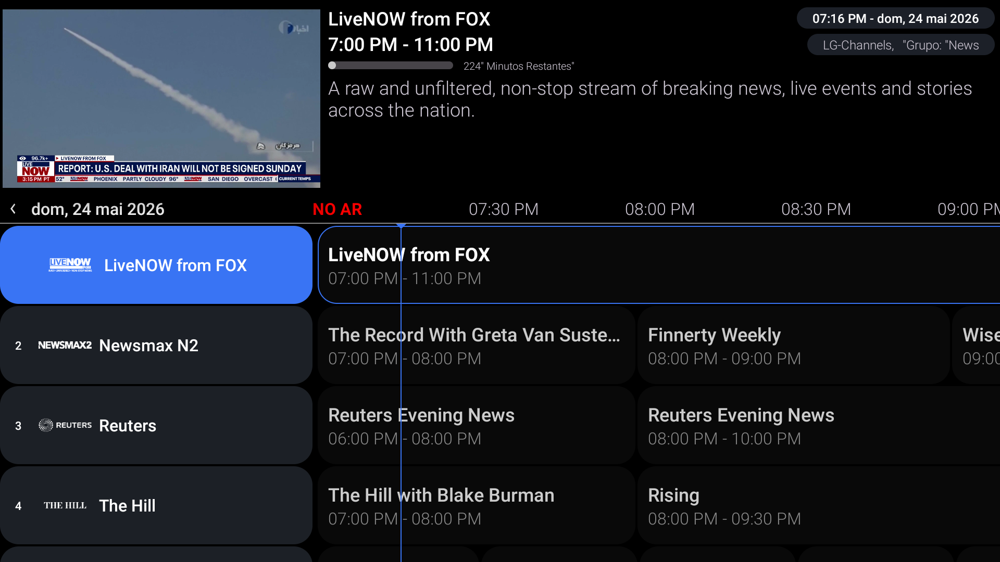

# 📺 LG Channels IPTV & EPG Extractor


Este projeto realiza engenharia reversa de forma automatizada na API oficial do **LG Channels (WebOS)** para extrair a lista completa de canais gratuitos (FAST Channels) da região dos Estados Unidos (`US`), gerando listas no formato **M3U8** e guias de programação analíticos em **XMLTV (EPG)**.

A atualização dos links de transmissão (tokens CDN) e da grade horária é executada de forma 100% autônoma a cada 6 horas utilizando o **GitHub Actions**.

---




---

## 🌍 Status de Suporte por Região

| Região | Código | Canais (M3U) | Guia (EPG) | Status | Notas |
| :--- | :---: | :---: | :---: | :---: | :--- |
| **United States** | `US` | 🟢 Funcional | 🟢 Funcional | `Active` | Infraestrutura validada via Xumo/Amagi. Atualização a cada 6h. |
| **United Kingdom** | `UK` | 🟡 Em Testes | 🔴 Indisponível | `In Progress` | Endpoint `/schedulelist` rejeitando fuso horário local. |
| **Brasil** | `BR` | 🟡 Em Testes | 🔴 Indisponível | `In Progress` | Arquitetura de API diferente (Erro 500/404). Mapeamento em andamento. |


---


---

## 🚀 Funcionalidades

* **Extração Direta:** Consome diretamente os endpoints nativos da LG simulando um ambiente WebOS real.
* **Limpeza de Links:** Remove automaticamente parâmetros de rastreamento de anúncios (`?ads.deviceid=...`) deixando as streams diretas e fluidas para qualquer player.
* **Categorização Automática:** Organiza os canais em grupos nativos (News, Movies, Sports, etc.).
* **EPG Integrado:** Mapeia os nós `startDateTime`, `endDateTime`, `programTitle` e `description` gerando um guia XMLTV estruturado.
* **Sincronização Perfeita:** Injeta tags `tvg-id` idênticas no M3U e no XML para garantir o pareamento automático da grade no seu player.
* **Prevenção de Falhas:** Tratamento de caracteres especiais (`&` para `&amp;`) e mitigação de erros por dados nulos (`NoneType`).

---

## 🛠️ Como Funciona a Arquitetura

O ecossistema roda inteiramente na nuvem de forma gratuita:

1. **Gatilho (Cron Job):** O GitHub Actions inicializa uma máquina virtual Ubuntu a cada 6 horas.
2. **Spoofing de Cabeçalhos:** O script Python faz a requisição contornando os bloqueios de segurança da LG usando chaves de autenticação de serviço e agentes de usuário de Smart TVs reais.
3. **Processamento de Dados:** O JSON retornado é quebrado e formatado em dois arquivos estáticos.
4. **Push Automático:** O bot do GitHub commita as atualizações diretamente de volta para o repositório principal.

---

## 📋 Como Utilizar no seu Player de IPTV

Para rodar em players como **Tivimate, IPTV Smarters, Perfect Player ou VLC**, você só precisa dos links de entrega direta (*Raw*) do GitHub.

### 1. Playlist de Canais (M3U)
Copie e adicione ao seu player como uma nova Lista de Reprodução:
```text
https://raw.githubusercontent.com/JulioCesarXY/EPG-LG-Channels/main/lg_channels_us.m3u
